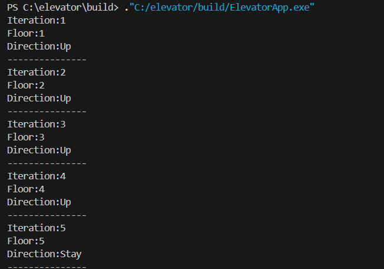

# Elevator Simulation

Elevator Operation Model The elevator's logic is as follows: We start from the first floor (if no starting floor is selected) and the direction is not selected, the default is "stay." We remove the irrelevant floor from the floor and elevator request sets. We move to the next floor depending on the direction. If there was a "stay," the elevator stops. We select a direction. If there are requests in the same direction, we continue moving in the selected direction. If there are no requests in the same direction, we select the opposite direction. If there are no requests, the elevator stops. If it reaches the first or last floor, the elevator also stops.

# Model demonstration example



# Build
mkdir build
cd build
cmake ..
make

# Run
./build/ElevatorApp.exe

# Run tests
```bash
cd build/tests
./tests.exe
```
or

```bash
cd build
ctest
```
# Requirements
C++ 17
CMake 4.2.3
gtest
